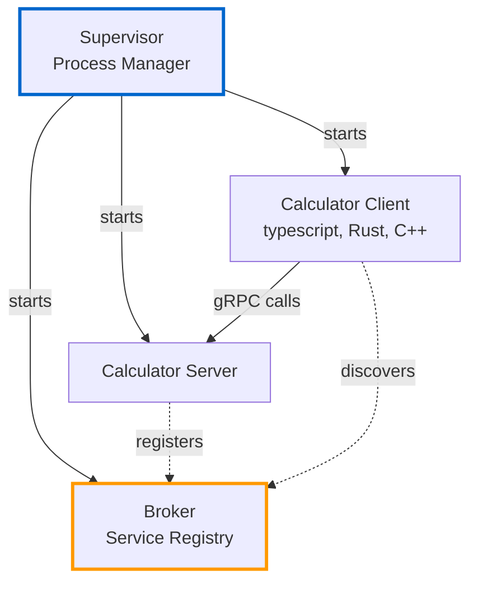
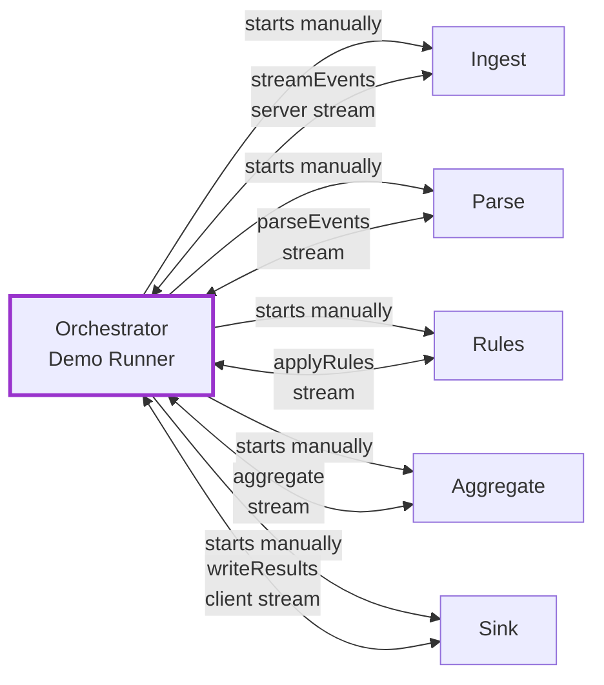
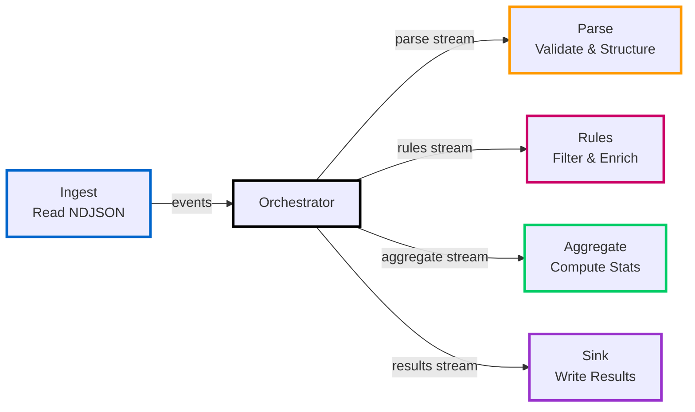

# Architecture

At a high level, the runtime consists of a supervisor that starts processes and a broker that connects them. Services communicate via gRPC and protobuf contracts.

## Two Different Architectures

The repository demonstrates two separate approaches:

### 1. Calculator Example (with Supervisor/Broker)

**Components:**

- **Supervisor:** launches and manages processes from `config.yaml`
- **Broker:** service registry for discovery
- **Services:** register with broker, discover each other dynamically

### 2. Demo Pipeline (without Supervisor/Broker)

**Components:**

- **Orchestrator:** demo script that starts services and forwards data between stages
- **Services:** hardcoded ports, no service discovery
- **No Supervisor/Broker:** services are started by the demo script directly

::: info Why Two Approaches?

- **Calculator example** demonstrates the supervisor/broker pattern for dynamic service management
- **Demo pipeline** focuses on performance measurements without the overhead of service discovery

The demo pipeline scripts (`run-split-pipeline.mjs`) spawn services as child processes with fixed ports.
The orchestrator is the gRPC client for all pipeline services; services do not open direct gRPC connections to each other.
:::

## Supervisor Scope and Limitations

The supervisor is a practical option for running processes in a concrete project and for integrating this test system on a single platform. It is also an example of how process management can look, not a universal solution.

In distributed deployments across multiple machines, a single supervisor instance is not sufficient. A higher-level mechanism is required to ensure supervisors are themselves reliable and coordinated.

Operating systems and platform tooling (for example Linux service managers or cluster orchestration stacks) often provide stronger primitives for long-term supervision and distribution. This project does not replace those layers. At that level, project integrators are responsible for selecting and operating the appropriate infrastructure.

These constraints are known and intentional. The goal here is a clear, local-first runtime for experiments and demos, not a full platform replacement.

## Topology and Dashboard

The runtime also includes a topology stack and a dashboard for live observability:

- **Topology stack:** `apps/topology` bundles the gRPC topology service, an SSE proxy, and a reporter HTTP proxy.
- **Dashboard:** `apps/dashboard` renders the live topology graph, service list, active connections, and stream status.
- **Reporter client (TypeScript):** `packages/topology-reporter` provides a reusable gRPC reporter library.
- **Reporter client (Rust):** `apps/topology-reporter-rust` provides a Rust helper for registering services and reporting activity.

This layer makes it easier to verify that services are registered, connected, and actively communicating while the supervisor is running.

## Demo Pipeline Flow

The split pipeline processes events through five stages:

**Stage responsibilities:**

1. **Ingest** - reads NDJSON and streams events to the orchestrator
2. **Parse** - validates JSON, structures data, handles WorkItems
3. **Rules** - filters events (e.g., removes 'view' events), enriches data
4. **Aggregate** - computes counts, sums, and averages per event type
5. **Sink** - writes final results and prints metrics

gRPC pattern by stage:

- **Ingest:** server-streaming RPC to orchestrator
- **Parse / Rules / Aggregate:** streaming RPCs used by orchestrator
- **Sink:** client-streaming RPC from orchestrator with a final summary response

::: tip Performance Impact
Without batching, the orchestrator writes one message per event into parse/rules/aggregate streams, leading to high IPC overhead. With batching (size=100), stream writes on these legs are heavily amortized and throughput improves significantly.

See [Performance Deep Dive](/guide/performance) for detailed analysis.
:::

This architecture keeps local deployment simple while enabling independent upgrades and language choice per service.
