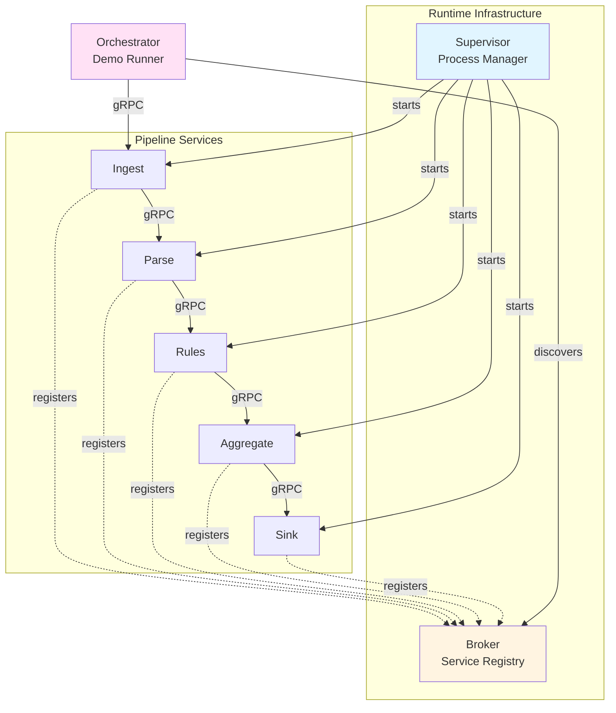
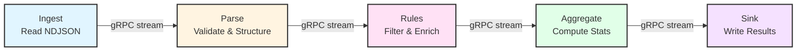

# Architecture

At a high level, the runtime consists of a supervisor that starts processes and a broker that connects them. Services communicate via gRPC and protobuf contracts.

## Core Components

**Components:**

- **Supervisor:** launches and supervises processes using a config file
- **Broker / Registry:** service discovery, lookups, and change notifications
- **Services:** small, single-purpose processes (ingest, parse, rules, aggregate, sink)
- **Orchestrator:** coordinates end-to-end runs for demo scenarios
- **Bridges (optional):** interceptors for logging, tracing, or policy enforcement

## Supervisor Scope and Limitations

The supervisor is a practical option for running processes in a concrete project and for integrating this test system on a single platform. It is also an example of how process management can look, not a universal solution.

In distributed deployments across multiple machines, a single supervisor instance is not sufficient. A higher-level mechanism is required to ensure supervisors are themselves reliable and coordinated.

Operating systems and platform tooling (for example Linux service managers or cluster orchestration stacks) often provide stronger primitives for long-term supervision and distribution. This project does not replace those layers. At that level, project integrators are responsible for selecting and operating the appropriate infrastructure.

These constraints are known and intentional. The goal here is a clear, local-first runtime for experiments and demos, not a full platform replacement.

## Demo Pipeline Flow

The split pipeline processes events through five stages:

**Stage responsibilities:**

1. **Ingest** - reads NDJSON and streams events to Parse
2. **Parse** - validates JSON, structures data, handles WorkItems
3. **Rules** - filters events (e.g., removes 'view' events), enriches data
4. **Aggregate** - computes counts, sums, and averages per event type
5. **Sink** - writes final results and prints metrics

Each arrow represents a **bidirectional gRPC streaming connection**. Services can be implemented in any language with gRPC support.

::: tip Performance Impact
Without batching, each event triggers a separate gRPC call, leading to 85% IPC overhead. With batching (size=100), overhead is amortized and throughput increases 3x.

See [Performance Deep Dive](/guide/performance) for detailed analysis.
:::

This architecture keeps local deployment simple while enabling independent upgrades and language choice per service.
