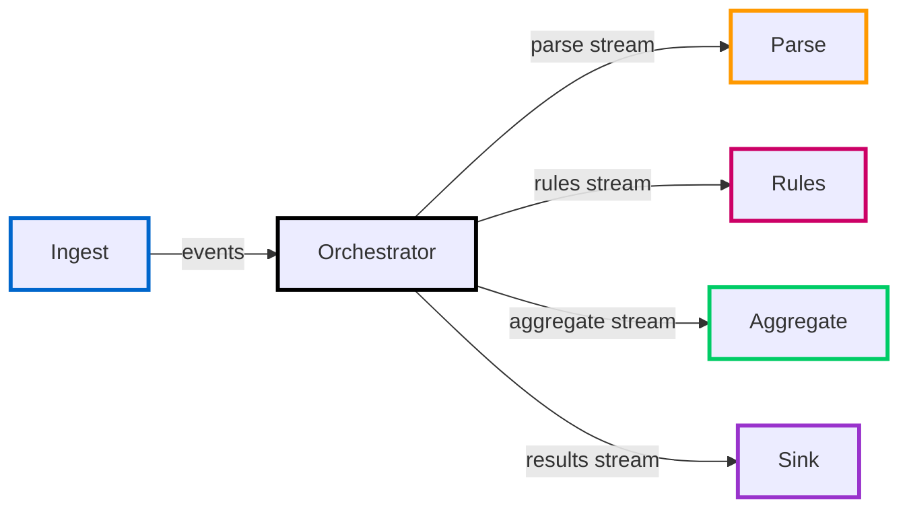
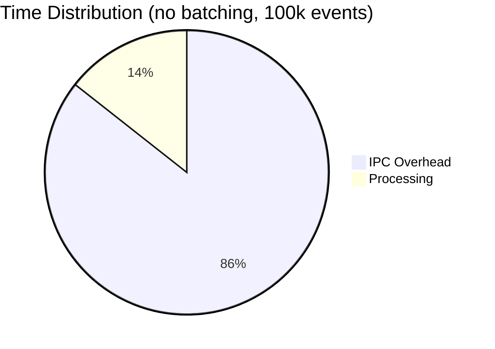
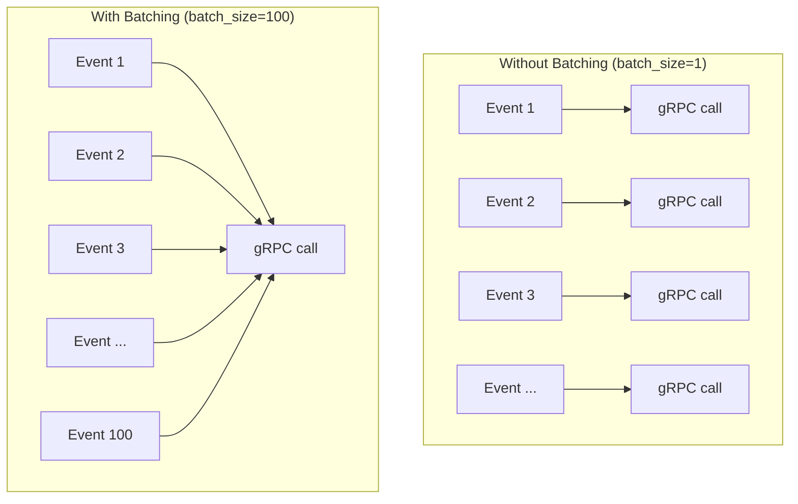
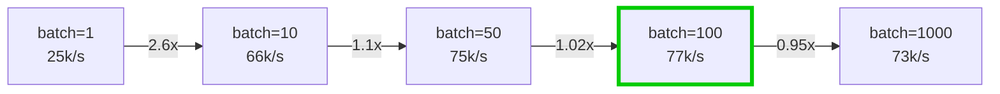
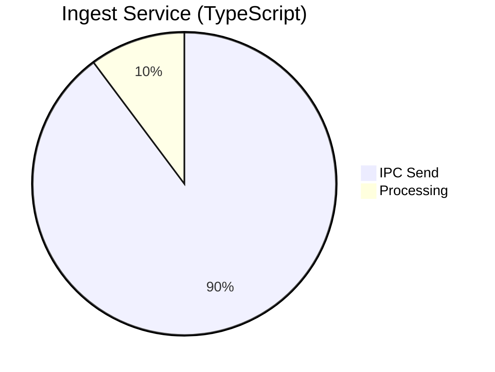
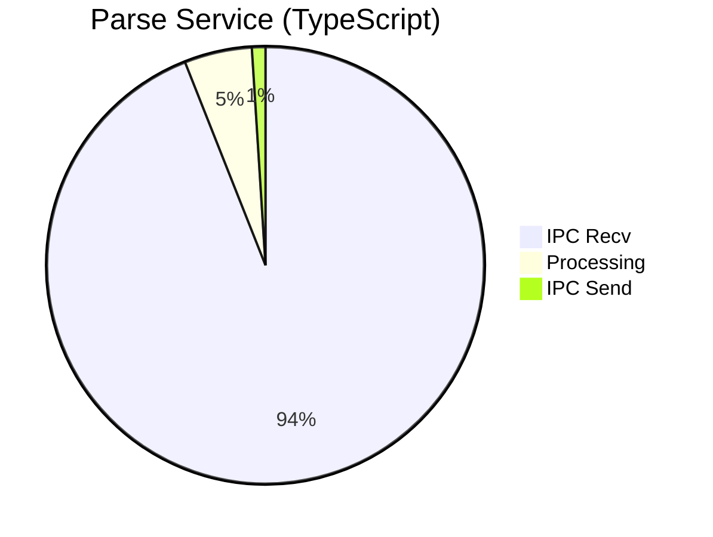
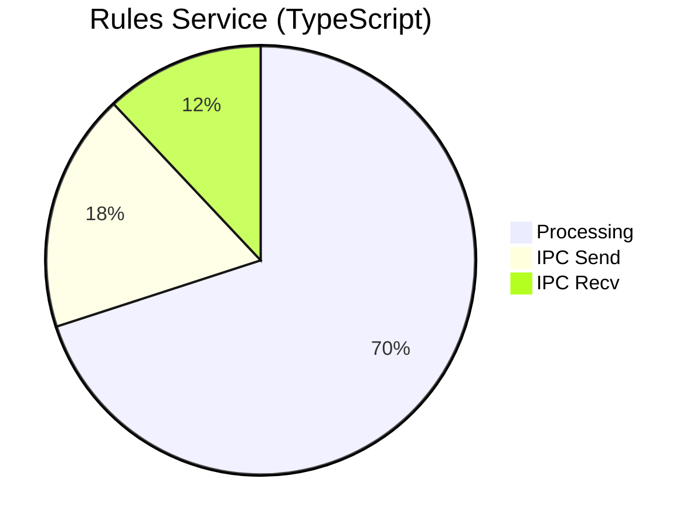
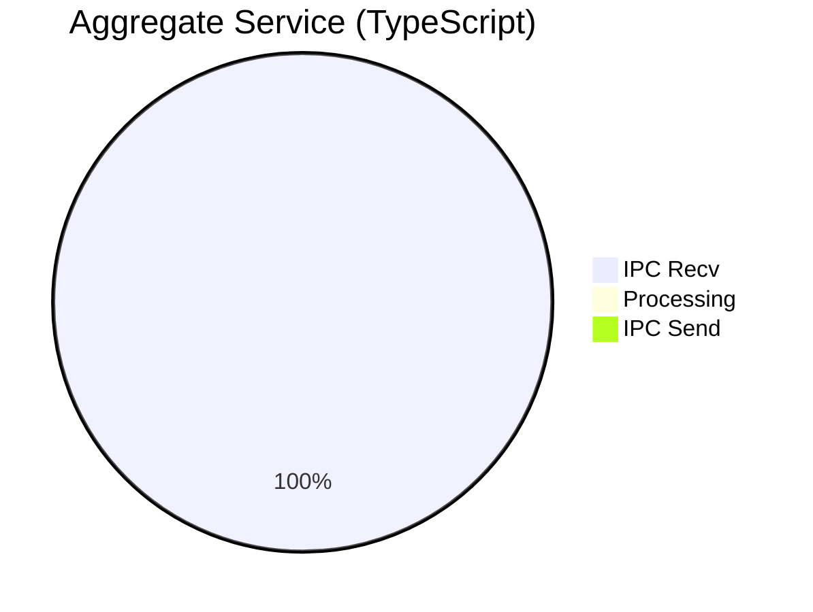
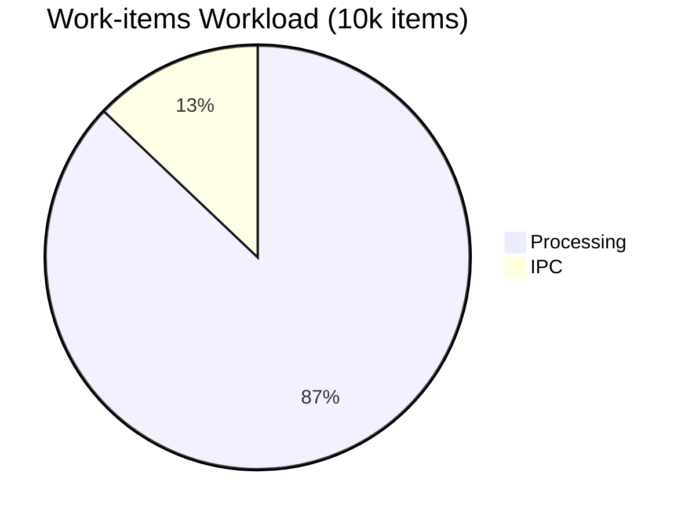

# Performance Deep Dive

This page explains how batching works, what the performance characteristics look like, and how language choice affects throughput.

## Pipeline Flow

The split pipeline processes events through five stages:



Transport details:

- Ingest -> Orchestrator uses server-streaming RPC.
- Parse/Rules/Aggregate are streaming RPCs driven by the orchestrator.
- Orchestrator -> Sink uses client-streaming RPC with a final summary response.

Without batching, every event still becomes an individual stream write on parse/rules/aggregate legs, so serialization and IPC overhead dominate.

## IPC Overhead Problem

Without batching, IPC dominates processing time:



The split pipeline spends **85.6% of time** on inter-process communication, while actual business logic takes only 14.4%. This is why the unbatched split is 2.8x slower than the monolith.

## Batching Solution

Inter-stage batching groups multiple events into one stream write on parse/rules/aggregate:



**Impact:** At `batch_size=100`, parse/rules/aggregate writes drop from roughly `300,000` to `3,000` for 100,000 events.

## Throughput Scaling

Performance improves dramatically with batching:

| Batch Size | Throughput   | vs Monolith | IPC Overhead |
| ---------- | ------------ | ----------- | ------------ |
| 1 (none)   | 25,265/s     | 0.57x       | 85.6%        |
| 10         | 66,845/s     | 1.52x       | 87.2%        |
| 50         | 75,700/s     | 1.72x       | 84.6%        |
| **100**    | **77,042/s** | **1.75x**   | **84.3%**    |
| 1000       | 73,529/s     | 1.67x       | 84.9%        |
| Monolith   | 44,071/s     | 1.0x        | 1.21%        |

**Key insight:** The sweet spot is **batch_size=50-100**. Beyond 100, throughput drops slightly due to increased latency per batch.



## Per-Service Breakdown

Where does time go at optimal batching (batch_size=100)?









**Observations:**

- **Rules** is the only service where processing dominates (70%)
- **Aggregate** is almost pure IPC (99.5% receive time)
- Even with batching, IPC still significant but now amortized across 100 events

## CPU-bound vs IO-bound Workloads

### Events Workload (IO-bound)

- Lightweight processing per event
- IPC overhead dominates without batching
- **Batching has massive impact** (3x improvement)

### Work-items Workload (CPU-bound)

- Heavy CPU processing per item (vector normalization, matrix transpose, checksum computation)
- Processing dominates (87-92% of time)
- **Batching has minimal impact** - CPU work is the bottleneck



This explains why batching doesn't help for CPU-intensive tasks - you can't batch away the actual computation.

## Language Performance: TypeScript vs Rust

### Events Workload (100k, batch=100)

| Implementation | Throughput   | vs TypeScript |
| -------------- | ------------ | ------------- |
| TypeScript     | 77,042/s     | 1.0x          |
| Rust (debug)   | 76,161/s     | 0.99x         |
| Rust (release) | **79,681/s** | **1.03x**     |

**Takeaway:** With proper optimizations and release builds, **Rust outperforms Node.js** by 3% for events.

### Work-items Workload (10k)

| Implementation | Throughput | vs TypeScript |
| -------------- | ---------- | ------------- |
| TypeScript     | 10,700/s   | 1.0x          |
| Rust (debug)   | 2,725/s    | 0.25x         |
| Rust (release) | 7,716/s    | 0.72x         |

**Takeaway:** TypeScript still leads for CPU-bound work by ~40%. This is likely due to:

- V8's highly optimized JIT for numeric operations
- IPC overhead differences (tonic vs gRPC-js)
- Room for further Rust micro-optimizations

## Key Learnings

1. **Batching is critical for IO-bound workloads** - can turn a 2.8x slowdown into a 1.75x speedup
2. **Release builds matter** - debug mode can be 10-20x slower in Rust
3. **Language choice is less important than you think** - with batching, TypeScript and Rust perform similarly
4. **Profile before optimizing** - understand where time is spent before making changes
5. **Sweet spot exists** - too small batches waste IPC, too large batches increase latency

## Running Your Own Tests

To reproduce these results:

```bash
# TypeScript baseline (no batching)
pnpm demo:split:baseline

# TypeScript with batching
pnpm demo:split:batch100

# Rust/Python/Go polyglot
pnpm demo:split:polyglot

# CPU-bound workload
pnpm demo:workload:10000
```

See [Demo Scenarios](/guide/demo-scenarios) for full flag documentation.
