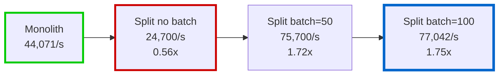
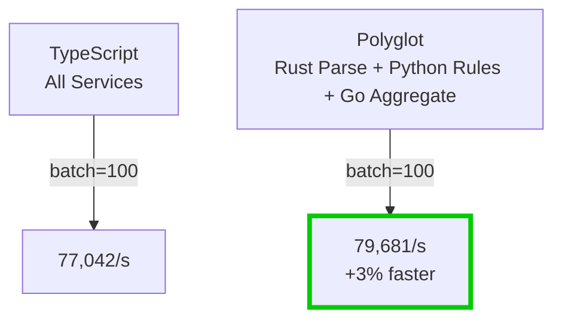

# Results Summary

This section summarizes measured results from the demo scenarios. Numbers come from repeated runs in `examples/demo-scenarios/RESULTS.md` and are included for relative comparison.

::: tip Next Steps
For detailed explanations of **why** these numbers look this way, see:

- [Performance Deep Dive](/guide/performance) - batching, IPC overhead, and per-service breakdowns
- [Rust Optimization](/guide/rust-optimization) - how Rust was optimized from 2.8x slower to 1.03x faster
  :::

## Key Takeaways

- ✅ **Correctness verified:** monolith and split outputs match for event workloads
- 📊 **Events (100k):** split without batching is ~0.57x monolith throughput
- 🚀 **With batching (50-100):** split reaches **1.75x monolith throughput**
- 🎯 **Optimal batch size:** 50-100 events per gRPC call
- 🦀 **Polyglot works:** with batching, Rust/Python/Go is close to (or slightly above) TypeScript and produces identical results
- 💪 **CPU-bound workloads:** processing dominates (87-92%); batching impact is minimal
- ⚡ **Rust optimized:** with release builds, Rust outperforms Node.js by 3% for events

## Events Workload (100k)

Baseline (no batching):

| Metric            | Monolith (C++) | Split (no batch) | Ratio |
| ----------------- | -------------- | ---------------- | ----- |
| Processing time   | 1.4s           | 3.95s            | 2.8x  |
| Throughput        | 44,071/s       | 24,700/s         | 0.56x |
| Latency per event | 0.023ms        | 0.040ms          | 1.7x  |
| IPC overhead      | 1.21%          | 85.6%            | 71x   |
| Results           | correct        | correct          | match |

Batching impact:

| Batch size | Processing time | Throughput | vs baseline | vs monolith | IPC overhead |
| ---------- | --------------- | ---------- | ----------- | ----------- | ------------ |
| 1 (none)   | 3.96s           | 25,265/s   | 1.0x        | 0.57x       | 85.6%        |
| 10         | 1.50s           | 66,845/s   | 2.6x        | 1.52x       | 87.2%        |
| 50         | 1.32s           | 75,700/s   | 3.0x        | 1.72x       | 84.6%        |
| 100        | 1.30s           | 77,042/s   | 3.0x        | 1.75x       | 84.3%        |
| 1000       | 1.36s           | 73,529/s   | 2.9x        | 1.67x       | 84.9%        |
| Monolith   | 1.38s           | 44,071/s   | -           | 1.0x        | 1.21%        |

## Polyglot Comparison (100k events)

| Batch size | TS throughput | Polyglot throughput | Ratio | Correctness |
| ---------- | ------------- | ------------------- | ----- | ----------- |
| 1 (none)   | 24,700/s      | 21,137/s            | 0.86x | identical   |
| 50         | 75,700/s      | 72,150/s            | 0.95x | identical   |
| 100        | 77,042/s      | 79,681/s            | 1.03x | identical   |

::: tip Rust Optimization Success
Initial Rust implementation (debug build) was 2.8x slower for CPU-bound workloads. After optimization (release build + JSON parsing fixes), Rust **outperforms TypeScript by 3%** for events.

Read the full story: [Rust Optimization Case Study](/guide/rust-optimization)
:::

## Work-items Workload (CPU bound)

| Work items | Time  | Throughput | Processing | IPC   |
| ---------- | ----- | ---------- | ---------- | ----- |
| 10,000     | 0.94s | 10.7k/s    | 87.1%      | 12.9% |
| 50,000     | 4.21s | 11.9k/s    | 91.4%      | 8.6%  |
| 100,000    | 9.66s | 10.4k/s    | 92.4%      | 7.6%  |

Small deviations between runs are expected due to system load and I/O jitter.
