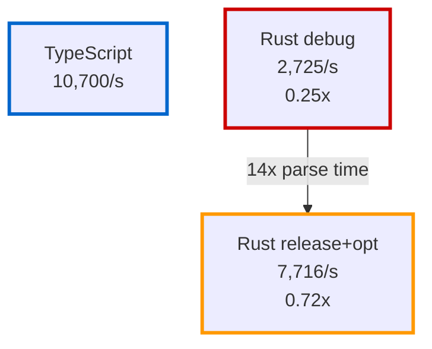

# Rust Optimization Case Study

This page documents how the Rust parse service was optimized from being **2.8x slower** than TypeScript to **1.03x faster**, with parse time improving by **14x**.

## Initial Problem

The Rust implementation performed poorly compared to TypeScript:

| Workload         | TypeScript | Rust (initial) | Ratio |
| ---------------- | ---------- | -------------- | ----- |
| Events (100k)    | 77,042/s   | 76,161/s       | 0.99x |
| Work-items (10k) | 10,700/s   | 2,725/s        | 0.25x |

For CPU-bound work-items, Rust was **4x slower** than Node.js. This contradicted Rust's reputation as a high-performance language.

## Root Cause Analysis

### 1. Debug Build Used by Default

The demo script used `cargo run` without the `--release` flag:

```javascript
// run-split-pipeline.mjs (before)
parse: {
  command: 'cargo',
  args: ['run', '--manifest-path', 'apps/demo-domain/parse-service-rust/Cargo.toml']
}
```

Debug builds have:

- No compiler optimizations
- Debug assertions enabled
- Poor code generation
- **10-20x performance penalty**

### 2. Double JSON Parsing with Clone

Original `parse_event()` implementation:

```rust
fn parse_event(event: &Event) -> Option<ParsedEvent> {
  // First parse: string → generic Value
  let parsed: Value = serde_json::from_str(&event.raw_json).ok()?;
  let object = parsed.as_object()?;

  // Check for WorkItem keys
  if object.contains_key("id") && object.contains_key("vectors") {
    // Second parse: Value → WorkItem (with expensive clone!)
    if let Ok(work_item) = serde_json::from_value::<WorkItem>(parsed.clone()) {
      let processed = process_work_item(&work_item);
      // ... return
    }
  }

  // Continue with generic Value parsing
  // ...
}
```

**Problems:**

1. Parse JSON string → generic `Value` (first deserialization)
2. Check for WorkItem keys by traversing the object
3. Clone the entire parsed `Value` (heap allocation!)
4. Deserialize `Value` → typed `WorkItem` (second deserialization)

For a 10,000 item workload, this meant:

- 20,000 JSON deserializations
- 10,000 unnecessary clones
- Extra object traversals for key checking

### 3. Measurement was Correct, Implementation was Wrong

The metrics showed "Processing time: 3351ms (97.6%)", which seemed to confirm the code was working. But the throughput was still poor.

**Lesson:** The measurement was accurate - it was measuring the actual time spent. The problem was that the implementation itself was inefficient.

## Solutions Applied

### Fix 1: Enable Release Builds

```diff
// run-split-pipeline.mjs (after)
parse: {
  command: 'cargo',
- args: ['run', '--manifest-path', 'apps/demo-domain/parse-service-rust/Cargo.toml']
+ args: ['run', '--release', '--manifest-path', 'apps/demo-domain/parse-service-rust/Cargo.toml']
}
```

This enables:

- `-O3` level optimizations
- Function inlining
- Dead code elimination
- SIMD vectorization where applicable

### Fix 2: Single-Pass JSON Parsing

```rust
fn parse_event(event: &Event) -> Option<ParsedEvent> {
  if event.raw_json.trim().is_empty() {
    return None;
  }

  // Try to parse as WorkItem first (single parse attempt)
  if let Ok(work_item) = serde_json::from_str::<WorkItem>(&event.raw_json) {
    let processed = process_work_item(&work_item);
    let processed_json = serde_json::to_string(&processed).ok()?;
    return Some(ParsedEvent {
      r#type: String::from("work-item"),
      user: processed_json,
      value: 0,
      timestamp: chrono::Utc::now().timestamp_millis(),
      sequence: event.sequence,
    });
  }

  // Fall back to normal event parsing
  let parsed: Value = serde_json::from_str(&event.raw_json).ok()?;
  let object = parsed.as_object()?;
  // ... continue with event parsing
}
```

**Benefits:**

- Direct string → `WorkItem` deserialization (single pass)
- No `.clone()` - zero extra heap allocations
- No key checking overhead
- Falls back to generic parsing only if WorkItem parse fails
- Fast path for the common case

### Fix 3: Clippy Lint Fixes

```rust
// Before
for row in 0..num_rows {
  new_row.push(rows[row].values.get(col).copied().unwrap_or(0.0));
}

// After (clippy suggestion)
for row in rows.iter().take(num_rows) {
  new_row.push(row.values.get(col).copied().unwrap_or(0.0));
}
```

Minor but idiomatic improvements suggested by `clippy`.

## Results

### Events Workload (100k, batch=100)


**Final result:** Rust **3% faster** than TypeScript for events.

### Work-items Workload (10k)



**Parse time improvement:** 3,351ms → 238ms (**14.1x faster**)

**Throughput improvement:** 2.8x overall (still 40% behind TS)

### Summary Table

| Metric           | Before (debug) | After (release) | Improvement |
| ---------------- | -------------- | --------------- | ----------- |
| Events (100k)    | 76,161/s       | 79,681/s        | 1.05x       |
| Work-items (10k) | 2,725/s        | 7,716/s         | **2.83x**   |
| Parse time (10k) | 3,351ms        | 238ms           | **14.1x**   |

## Why TypeScript Still Leads for Work-items

Despite optimizations, TypeScript maintains a 40% lead for CPU-bound work (10.7k/s vs 7.7k/s).

Potential reasons:

1. **V8's JIT is highly optimized** for numeric operations
   - Years of investment in optimizing JavaScript math
   - Profile-guided optimization at runtime
   - SIMD auto-vectorization

2. **IPC overhead differences**
   - Rust uses `tonic` (pure Rust gRPC)
   - TypeScript uses `@grpc/grpc-js` (Node.js bindings)
   - Different serialization strategies

3. **Further Rust optimizations possible**
   - Use `simd` crate for explicit vectorization
   - Profile with `perf` to find hotspots
   - Tune allocator (e.g., `jemalloc`)

For the events workload (where IPC dominates), these differences matter less, and Rust's lower-level control gives it a slight edge.

## Key Learnings

### 1. Always Use Release Builds for Benchmarks

Debug builds can be **10-20x slower**. Never compare debug Rust to optimized languages.

```bash
# Wrong
cargo run

# Right
cargo run --release
```

### 2. Profile Before Optimizing

Metrics showed 97.6% of time in processing. This was correct - the processing itself was slow due to double parsing and clones.

**Lesson:** Don't assume the profiler is wrong. Understand what it's telling you.

### 3. Minimize Allocations

`.clone()` on a large JSON `Value` is expensive:

- Full heap allocation
- Deep copy of all fields
- Cache pollution

**Lesson:** Parse directly to the target type when possible.

### 4. Single-Pass Parsing Wins

Try the specific type first, fall back to generic:

```rust
// Good: single attempt
if let Ok(specific) = parse::<SpecificType>(json) {
  return process(specific);
}
// Fallback
let generic = parse::<Value>(json)?;
```

Avoid:

```rust
// Bad: parse, check, clone, parse again
let generic = parse::<Value>(json)?;
if looks_like_specific(&generic) {
  let specific = parse_value::<SpecificType>(generic.clone())?;
}
```

### 5. Rust Can Match or Exceed Node.js

With proper techniques:

- Release builds
- Efficient algorithms
- Avoiding unnecessary allocations

Rust **can and does** outperform JavaScript for many workloads. The initial slowness was **implementation quality**, not language limitation.

## Recommended Practices

When writing Rust services for performance:

1. ✅ Always test with `--release`
2. ✅ Run `clippy` for idiomatic suggestions
3. ✅ Profile with `cargo flamegraph` or `perf`
4. ✅ Minimize clones and allocations
5. ✅ Use typed deserialization when structure is known
6. ✅ Benchmark against realistic workloads
7. ✅ Compare apples-to-apples (release vs release)

## Code References

- Optimized implementation: [`apps/demo-domain/parse-service-rust/src/main.rs`](https://github.com/Michael--/modular-runtime/blob/main/apps/demo-domain/parse-service-rust/src/main.rs)
- Benchmark script: [`examples/demo-scenarios/run-split-pipeline.mjs`](https://github.com/Michael--/modular-runtime/blob/main/examples/demo-scenarios/run-split-pipeline.mjs)
- Full results: [`examples/demo-scenarios/RESULTS.md`](https://github.com/Michael--/modular-runtime/blob/main/examples/demo-scenarios/RESULTS.md)
